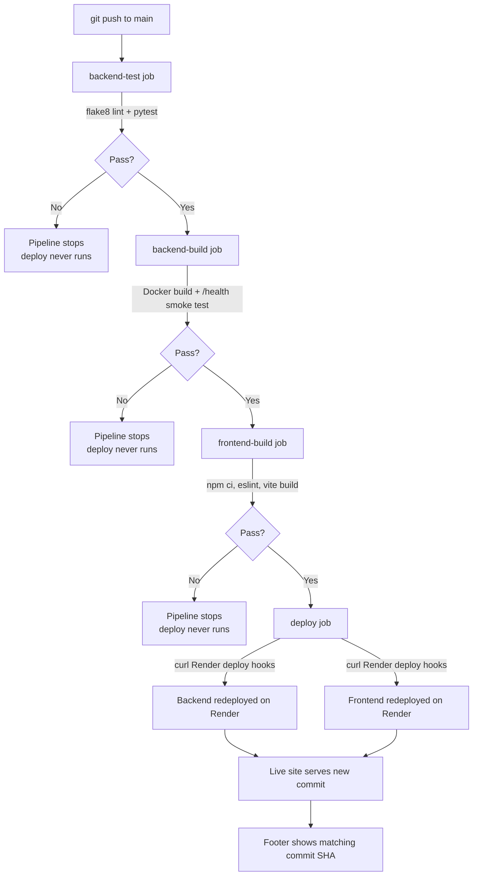

# BowlingAI — Bowling Action Pose Analysis

A dynamic web application that analyzes a bowler's action from an uploaded video using pose estimation, scores their form, and keeps a history of past analyses. Built and delivered through Git and a fully automated CI/CD pipeline as part of the CCA2 (Cloud Computing and DevOps) submission.

- **Live App:** https://bowlervisison.onrender.com _(frontend)_
- **Backend API:** https://bowlervisison.onrender.com _(replace with your actual backend URL if different)_
- **Repository:** https://github.com/aryandighe10/bowlervisison

---

## What it does

A user uploads a short video of their bowling action. The backend runs MediaPipe pose estimation on the frames, computes joint angles (elbow, front knee, rear knee, trunk) and body alignment, and returns a form score along with strengths, areas to improve, and recommendations. Every analysis is stored server-side and shown in a history list — this is the "form that changes data, redisplayed by the server" dynamic behaviour the assignment requires, not just a static results page.

**Core dynamic features:**
- `POST /analyze` — accepts a video file, runs pose detection, computes a score, and **persists** the result
- `GET /history` — returns the list of all past analyses (server-side data, not static)
- `GET /health` — health check, also returns the currently running commit SHA
- A footer on every page shows the live commit ID, proving the deployed code matches the latest passing pipeline run

---

## Architecture

```
bowlervisison/                  ← single repository (monorepo)
├── backend/                    ← FastAPI + MediaPipe pose-analysis service
│   ├── main.py                 ← routes: /, /health, /analyze, /history
│   ├── test_main.py            ← pytest suite
│   ├── requirements.txt
│   └── Dockerfile
├── src/                        ← TanStack Start (React, SSR) frontend
│   ├── routes/
│   │   ├── __root.tsx          ← root layout, includes the commit-ID footer
│   │   ├── index.tsx
│   │   ├── upload.tsx          ← video upload form
│   │   └── results.tsx         ← analysis results + history view
│   └── lib/analysis-store.ts   ← API URL config + client-side state
├── .github/workflows/ci-cd.yml ← the pipeline described below
└── README.md
```

The backend and frontend are deployed as two separate Render Web Services from this one repository, each with **Auto-Deploy off** — deployment only happens when GitHub Actions explicitly triggers it via a deploy hook, after all checks pass.

---

## Pipeline diagram



`frontend-build` runs independently of the backend jobs, but `deploy` waits on **both** `backend-build` and `frontend-build` succeeding before it fires either Render deploy hook — a failure anywhere in lint, tests, or build blocks the live site from updating.

---

## Running locally

### Backend

```bash
cd backend
python -m venv venv
venv\Scripts\Activate.ps1          # Windows PowerShell
# source venv/bin/activate         # macOS/Linux

pip install -r requirements.txt
uvicorn main:app --reload --port 8000
```

Requires **Python 3.11** specifically — MediaPipe does not yet support 3.12+.

Verify it's running:
```bash
curl http://localhost:8000/health
```

### Frontend

```bash
npm install
npm run dev
```

This starts the TanStack Start dev server. By default the app points at `http://localhost:8000` for the API — you can override this either by setting `VITE_API_URL`, or by pasting a different backend URL into the app's own API settings field (saved to `localStorage`).

### Running the production build locally

```bash
$env:NITRO_PRESET="node-server"   # PowerShell; use export on macOS/Linux
npm run build
$env:PORT="3000"
node .output/server/index.mjs
```

### Tests

```bash
cd backend
pytest -v
flake8 --max-line-length=120 main.py test_main.py
```

```bash
npm run lint
npm run build
```

---

## CI/CD pipeline

Defined in [`.github/workflows/ci-cd.yml`](.github/workflows/ci-cd.yml), triggered on every push and pull request to `main`:

| Job | What it does |
|---|---|
| `backend-test` | Installs backend deps, runs `flake8` lint, runs the `pytest` suite |
| `backend-build` | Builds the backend's Docker image, runs it, and curls `/health` as a smoke test |
| `frontend-build` | Installs frontend deps, runs `eslint`, runs a production `vite build` |
| `deploy` | Only runs on a push to `main`, and only after `backend-build` and `frontend-build` both succeed — triggers Render's deploy hooks for both services |

## Deployment

- **Backend:** Render Web Service, Docker environment, root directory `backend/`, health check path `/health`
- **Frontend:** Render Web Service, Node environment, build command `npm ci && NITRO_PRESET=node-server npm run build`, start command `node .output/server/index.mjs`
- Both services have **Auto-Deploy disabled** — the only way code reaches production is through the `deploy` job above, so a broken test genuinely blocks a bad release rather than just being a visual warning.

## Individual submission

Built individually for CCA2 (Cloud Computing and DevOps, CSE30040) under my own GitHub account, with all commits authored by me and no shared/group repositories used.
